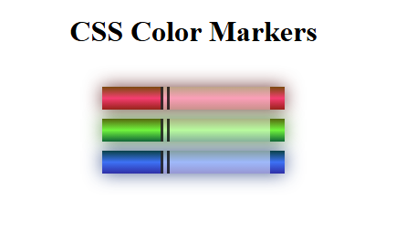

# 🎨 Colored Markers Project

This project is a simple HTML and CSS exercise where we create a visual representation of three colorful markers. It's part of the **Responsive Web Design Certification** from [freeCodeCamp.org](https://www.freecodecamp.org/).

---

## 📌 Features

- Use of `
` elements styled to resemble real markers  
- Applied custom colors using CSS background properties  
- Implemented positioning and size styling with `height`, `width`, `margin`, and `border-radius`  
- Practiced code organization and readability in CSS  

---

## 🧠 Learning Outcomes

- Strengthened understanding of basic HTML structure  
- Gained hands-on experience with `inline-block` and CSS box model  
- Learned how to simulate real-world objects using simple HTML/CSS  
- Practiced visual layout and spacing using margins & display properties  

---

## 🖼️ Screenshot

---

## 📚 Credits

Created as part of the [freeCodeCamp Responsive Web Design Course](https://www.freecodecamp.org/learn/responsive-web-design/).

